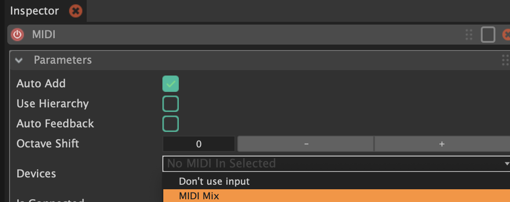
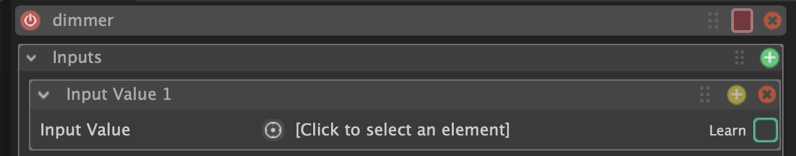
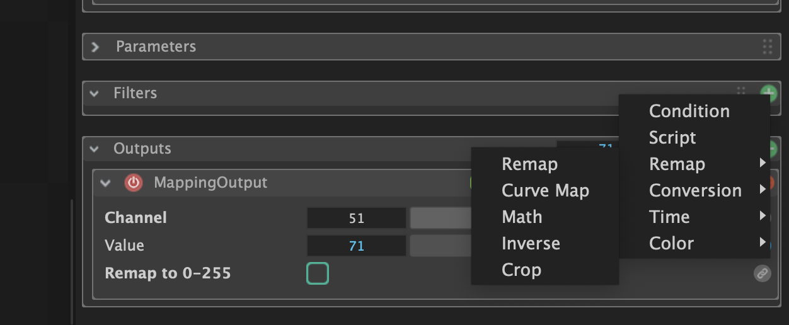

# Green Screen Studio lighting

**On how to use with almost full autonomy the light fixtures with Chataigne.**

The complete DMX patch of the current light fixtures installation of the green screen studio, with each parameter of the each fixture DMX adress can be found in the pdf `complete light patch`.

First step : turn on the light fixtures with the switch "prises" on the right from the door.

## Creating a timeline animation in Chataigne

The timeline allowing to create animation sequences is in the lower part of the interface :

Click on the gree ➕ bouton in `Sequences` part.

This sequence is a timeline, on which you can have multiple parameters automations to be read as the same time.

Click on the gree ➕ bouton in `Sequence Editor` part to create the first automation.

You can choose the automation type :
- `Trigger` will trigger events with no transition, by sending a value at a given moment on the timeline. It can be use for example to turn off all the fixtures at the same time.
- `Mapping` allows you to create a curve based animation. It can be used for example to modify the brightness following a curve or to slowly rotate a fixture.
- `Mapping 2D` is like Mapping, but in 2D, and allows you to create a 2D path based animation. More infos [here](https://bkuperberg.gitbook.io/chataigne-docs/the-time-machine-sequences/mapping-layer).
- `Audio` allows you to sync sound files to the sequence, but you need a sound card. It can be used for example to have sounds playing at the same time as animations.
- `Color` allows you to animation colors over time. It can be used for example to create colors interpolations of the fixtures.
- `Sequences` allows you to play multiple sequences at the same time or on the same timeline. You can for example create multiples animations sequences and assemble them on the timeline.

### Mapping a value

**1 : Creating the mapping**

Choose `Mapping`, and as we work with DMX we can start by modifying the `Range` (from 0 to 1) to 0 to 255. 
If you do it after having points on the timeline, you need first to choose `Range Remap Mode` > `Proportional` so the points are repositionned proportionally in the new range.

**2 : Record the curve**

There is two method to place points to create a curve in the sequence. The first method is to **draw directly on the timeline** of the Mapping, by holding `ctrl`+`shift` and dragging the mouse across while drawing your curve.

When you release the click, the yellow drawing becomes a curve with editable points for the finalise the curve.

You can also use a midi controller (see [midi set up](###-Set-up)), and **create the curve by recording midi values**.

To do so, check the inspector in the top right part of the screen.

In the `Recorder` part, click on `Learn` and touch one of the buttons/sliders/knobs of the midi controller so Chataigne detect the movement of midi values and assign it to the `Recorder`.

Then, check `Arm` in the `Recorder` or in the timeline, start playing the timeline and touch the same button/slider/knob of the midi controller to create a curve with the values received.

The curve is red during the recording, and becomes an editable curve when you pause the timeline.

⚠️ The midi values received will be between 0 and 127, so you should put the `Range` between 0 and 127, record with midi, then choose `Range Remap Mode` > `Proportional`, and change the `Range` to 0 and 255.

**3 : Output the mapping**

In the inspector, you can add one ou multiple outputs to the curve. Every automation/sequences can be assigned to multiples parameters and DMX channels for example.

Here, there is two way of assigning the curve to the white value of the top left lyre fixture : either by assigning it directly to the DMX channel, either by assigning it to the Custom Variable that I created for this parameter.

### Color animation

**1 : Creating the color animation**

By choosing `Color` as a sequence, the default color on the timeline is red.

To add colors, you just double-click on the timeline to add editable points.

You can change the color of the point by clicking it, opening the inspector (top right) and double-clicking on the square on the very top right :

You can then choose the exact color, opacity, and hex code of the color if needed.

In the inspector, you can also change the exact position of the color point on the timeline with `Time`, and the transition with the next color with `Interpolation` (Linear = gradient, None = no transition).

**2 : Output the color animation**

In the `Outputs` part of the inspector, you can assign the color animation to the light fixtures in two ways :

- Either directly in DMX, with `Set Color` and choosing the start channel of the color (the channel of the red value, the next ones will alway be the green value then the blue value). Here it's 109 for the top left fixture :

- Either by assigning the Custom Variables of each color values :

To do so, in the `Value` line, you need to click on the little link 🔗 symbol and choose the corresponding color.

## Midi-learn in Chataigne

To change some parameters with a midi controller, by automatically pairing the midi value to the parameter.

### Set up

I am using a Midimix, with 24 knobs, 20 buttons and 9 sliders.

To use a midi controller, we add a MIDI module in the modules part on the left of the interface.

In the inspector of the module, we can choose our midi controller.

When `Auto Add` is checked, and `Is Connected` is active, we can see the values changing in real time in the Values part of the inspector.

### Adding the 

To pair a midi value with a DMX channel or a parameter, you need to click on the mapping of the parameter. Here, the dimmer of the PAR WW fixture :

You create a new input by clicking on the ➕ button on the top right of the Inputs part.

By checking `Learn` on the right, then touching one of the buttons/sliders/knobs of the midi controller, the midi value is automatically paired to the mapping value of the parameter (here the value of CC19).

⚠️ The midi controller sends values between 0 to 127, and the DMX receive values between 0 and 255. If we don't remap the values, each parameters will be "half-off" : sending max brightness from the midi controller will only result in half brightness on the fixture, the pan would only be half of the axis, and so on.

So we need to remap the values from the input so the output can be between 0 and 255.
To do so, we add a filter by clicking on the ➕ of the Filters part, and we do `Remap` > `Remap`.

We set the input range to 0 and 127, and the output range to 0 and 255.

⚠️ The midi control should be the first input in the inputs list if there is multiple inputs and you want the midi control to have priority over the others.

## To go further

The [intro tuto to Chataigne (FR)](https://github.com/LucieMrc/Chataigne_2spi).